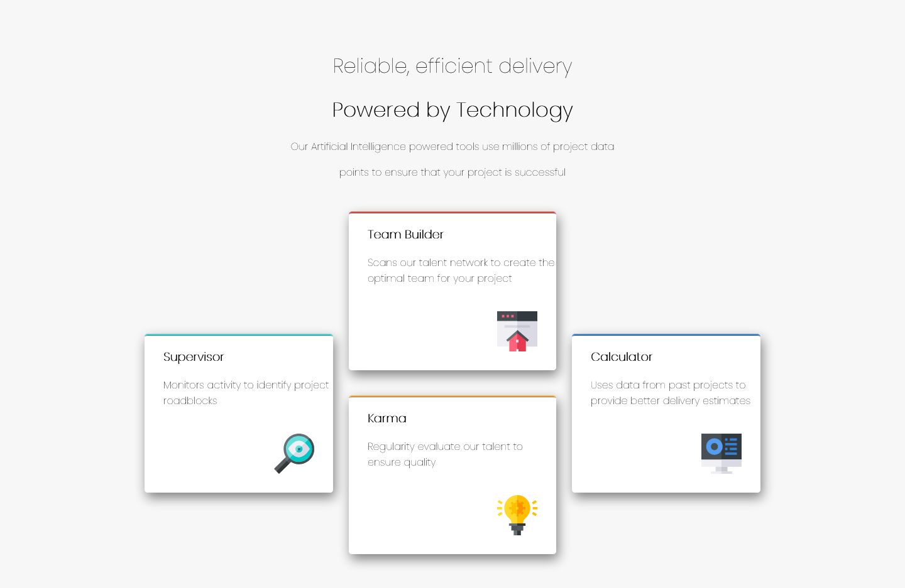

# Frontend Mentor - Four card feature section solution

This is a solution to the [Four card feature section challenge on Frontend Mentor](https://www.frontendmentor.io/challenges/four-card-feature-section-weK1eFYK). Frontend Mentor challenges help you improve your coding skills by building realistic projects. 

## Table of contents

- [Overview](#overview)
  - [The challenge](#the-challenge)
  - [Screenshot](#screenshot)
  - [Links](#links)
- [My process](#my-process)
  - [Built with](#built-with)
  - [What I learned](#what-i-learned)
  - [Continued development](#continued-development)
  - [Useful resources](#useful-resources)
- [Author](#author)
- [Acknowledgments](#acknowledgments)


## Overview

### The challenge

Users should be able to:

- View the optimal layout for the site depending on their device's screen size

### Screenshot



Add a screenshot of your solution. The easiest way to do this is to use Firefox to view your project, right-click the page and select "Take a Screenshot". You can choose either a full-height screenshot or a cropped one based on how long the page is. If it's very long, it might be best to crop it.

Alternatively, you can use a tool like [FireShot](https://getfireshot.com/) to take the screenshot. FireShot has a free option, so you don't need to purchase it. 

Then crop/optimize/edit your image however you like, add it to your project, and update the file path in the image above.

### Links

- Solution URL: [Add solution URL here](https://github.com/chizhengandey/FourCardFeatureSection)
- Live Site URL: [Add live site URL here](None)

## My process

### Built with

- Semantic HTML5 markup
- CSS custom properties 

### What I learned

Use a large parent div to include four child divs as section pages, box-shadow

To see how you can add code snippets, see below:

```html
  <div class="Parent">
    <div class="Teambuilder">
      <h3>Team Builder</h3>
      <p>Scans our talent network to create the optimal team for your project</p>
      
    </div>
    <div class="Karma">
      <h3>Karma</h3>
      <p>Regularity evaluate our talent to ensure quality</p>
      
    </div>
    <div class="Supervisor">
      <h3 style="text-align: left; padding-left: 30px">Supervisor</h3>
      <p style="text-align: left; padding-left: 30px">Monitors activity to identify project roadblocks</p>
      
    </div>
    <div class="Calculator">
      <h3 style="text-align: left; padding-left: 30px">Calculator</h3>
      <p style="text-align: left; padding-left: 30px">Uses data from past projects to provide better delivery estimates</p>
      
    </div>
  </div>
```
```css
.Teambuilder {
  background-color: white;
  border-top-style:ridge;
  border-top-color: hsl(0, 78%, 62%);
  border-radius: 5px;
  height: 250px;
  width: 300px;
  margin: 0 auto;
  text-align: left;
  padding-left: 30px;
  box-shadow: 3px 8px 18px grey;
}
```


If you want more help with writing markdown, we'd recommend checking out [The Markdown Guide](https://www.markdownguide.org/) to learn more.

### Continued development

Alternative way uisng CSS grid to create section pages

### Useful resources

https://www.w3schools.com/cssref/css3_pr_box-shadow.asp to create box shadow

https://developer.mozilla.org/en-US/docs/Web/CSS/CSS_Selectors


## Author

- Website - [Add your name here](https://www.your-site.com)
- Frontend Mentor - [@yourusername](https://www.frontendmentor.io/profile/yourusername)
- Twitter - [@yourusername](https://www.twitter.com/yourusername)

**Note: Delete this note and add/remove/edit lines above based on what links you'd like to share.**

## Acknowledgments

Helps from stackoverflow users
